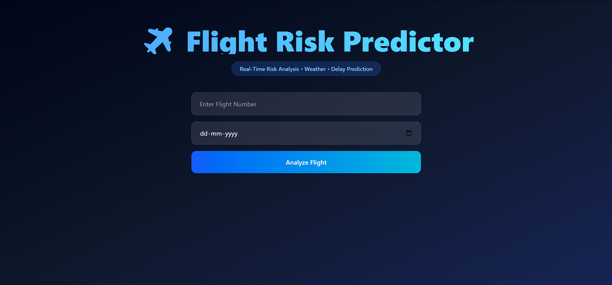
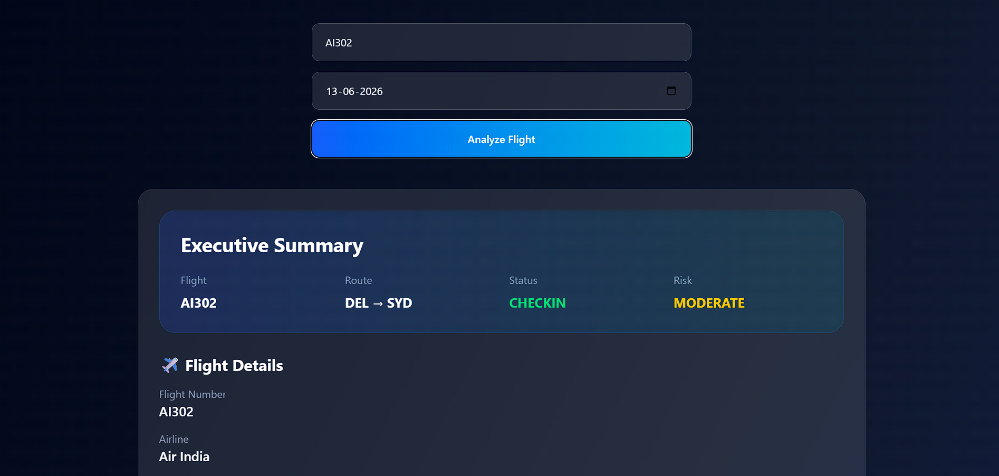
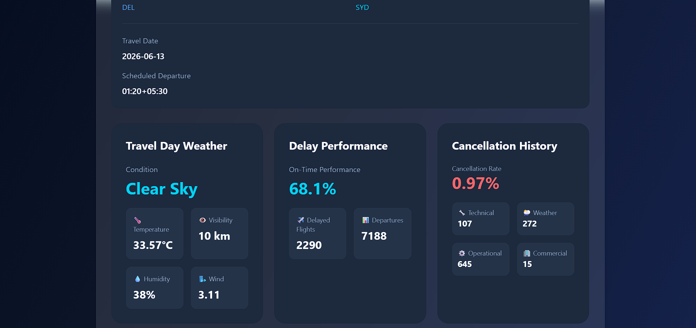
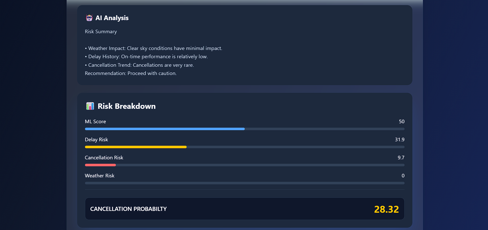
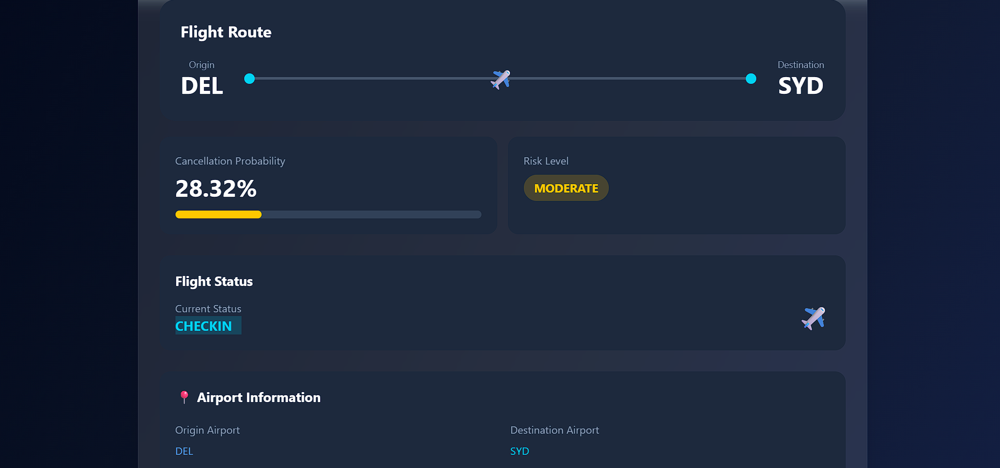
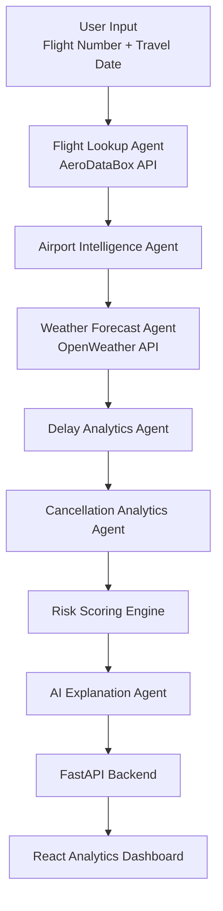

# ✈️ Flight Risk Predictor

### AI-Powered Aviation Analytics & Risk Assessment Platform

Flight Risk Predictor is a full-stack aviation analytics platform that evaluates the probability of flight disruptions using real-time flight intelligence, travel-day weather forecasts, historical airline performance, and AI-driven risk analysis.

The platform helps travelers make informed decisions by combining multiple operational factors into a single risk assessment dashboard with actionable recommendations.

---

## 🚀 Features

### Flight Intelligence

* Real-time flight lookup
* Flight status tracking
* Route information
* Airport intelligence
* Departure schedule analysis

### Weather Analytics

* Travel-day weather forecasting
* Temperature analysis
* Humidity monitoring
* Visibility assessment
* Wind speed analysis
* Weather condition tracking

### Airline Performance Analytics

* Historical delay performance
* On-time performance analysis
* Delayed flight statistics
* Historical cancellation analysis
* Airline reliability insights

### Risk Assessment

* Flight disruption probability scoring
* Delay risk analysis
* Cancellation risk analysis
* Weather impact analysis
* Risk categorization (Low, Moderate, High)

### AI-Powered Insights

* Automated risk explanations
* Passenger-friendly recommendations
* Multi-factor disruption analysis
* Travel decision support

---

## 📸 Dashboard Preview

## 📸 Screenshots

### 🏠 Home Page

Modern aviation analytics dashboard with flight lookup and travel date forecasting.

---

### 📊 Executive Summary

Comprehensive flight overview displaying route information, flight status, disruption probability, and risk classification.

---

### 🌦️ Weather, Delay & Cancellation Analytics

Travel-day weather forecasting combined with historical delay performance and cancellation analytics.

---

### 📈 Risk Breakdown Dashboard

Detailed breakdown of disruption probability including:

* ML Risk Score
* Delay Risk
* Cancellation Risk
* Weather Risk
* Final Flight Disruption Probability

---

### 🎯 Disruption Probability Analysis

Interactive visualization of overall flight disruption probability and risk categorization.

---

## 🏗 System Architecture

---

## 🤖 Multi-Agent Workflow

### Flight Lookup Agent

Retrieves:

* Airline information
* Flight status
* Origin airport
* Destination airport
* Departure schedule

### Airport Intelligence Agent

Maps airport information and route metadata to support weather and operational analysis.

### Weather Forecast Agent

Fetches travel-day weather forecasts using:

* Temperature
* Humidity
* Visibility
* Wind Speed
* Weather Conditions

### Delay Analytics Agent

Analyzes historical airline performance:

* On-Time Performance
* Delayed Flights
* Total Departures

### Cancellation Analytics Agent

Evaluates historical cancellation trends:

* Cancellation Rate
* Technical Issues
* Operational Disruptions
* Weather Disruptions
* Commercial Causes

### Risk Engine

Calculates flight disruption probability using:

* Weather Conditions
* Delay Performance
* Cancellation History
* Operational Risk Factors

### AI Recommendation Agent

Generates:

* Risk explanations
* Operational insights
* Passenger recommendations

---

## 📊 Risk Assessment Framework

The platform evaluates disruption probability by combining:

* Weather Risk
* Historical Delay Risk
* Historical Cancellation Risk

Output Categories:

* 🟢 Low Risk
* 🟡 Moderate Risk
* 🔴 High Risk

The system also provides a numerical disruption probability and detailed risk breakdown.

---

## 🛠 Tech Stack

### Frontend

* React.js
* Vite
* Tailwind CSS

### Backend

* FastAPI
* Python

### AI & Agentic Systems

* LangGraph
* LangChain
* Groq LLM
* Agent-Based Workflow Design

### APIs

* AeroDataBox API
* OpenWeather API

### Data Processing

* Pandas
* CSV-Based Analytics Engine

### Development Tools

* Git
* GitHub
* VS Code

---

## 📂 Project Structure

flight_prediction_agent/

├── flight-risk-frontend/

├── data/

│ ├── cancellation.csv

│ └── delay.csv

├── docs/

├── api.py

├── graph.py

├── flight_lookup_agent.py

├── weather_agent.py

├── airline_history_agent.py

├── delay_agent.py

├── risk_agent.py

├── explanation_agent.py

├── airline_mapper.py

├── requirements.txt

└── README.md

---

## 💡 Challenges Solved

### Flight Number Standardization

Handled multiple user input formats to ensure reliable flight retrieval across data sources.

### Weather Forecast Selection

Implemented travel-date-specific weather forecasting instead of relying on current weather conditions.

### Airline Name Normalization

Resolved inconsistencies across APIs and historical datasets to improve analytics accuracy.

### Missing Flight Data Handling

Added robust validation and fallback mechanisms to prevent system failures when APIs return incomplete information.

### Multi-Source Data Integration

Unified aviation, weather, delay, and cancellation data into a single analytics workflow.

### Airport Intelligence Mapping

Built airport-code-to-location mapping to support weather forecasting and operational analysis.

---

## 🎯 Future Roadmap

* Machine Learning-Based Delay Prediction
* Airport Congestion Analytics
* Airline Reliability Scoring
* Route Reliability Analytics
* Interactive Route Maps
* Historical Trend Visualization
* Real-Time Operational Alerts
* Cloud Database Integration
* User Flight Watchlists

---

## 👨‍💻 Author

### Priyanshu Raj

NIT Durgapur

Interests:

* Agentic AI
* Generative AI Applications
* Data Analytics
* Product Development
* Aviation Intelligence Systems
* Multi-Agent Architectures
